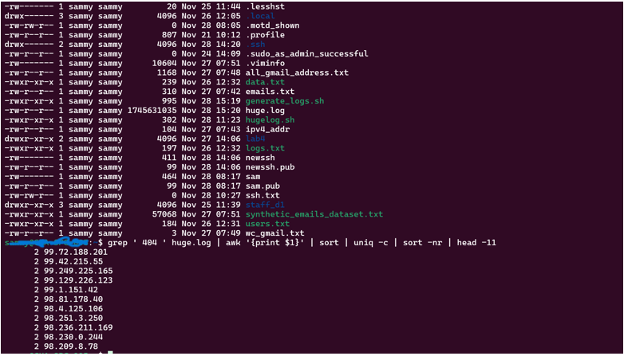

# Screenshot 1
  
Explanation: This screenshot shows the first 10 ip addresses that gave 404 error.

# Screenshot 2
  
Explanation: This screenshot shows the SCP command in action, transferring a file from the Windows client to the Ubuntu server.

# Screenshot 3
  
Explanation: This screenshot shows the files successfully appearing in the target Ubuntu directory after the SCP transfer.

